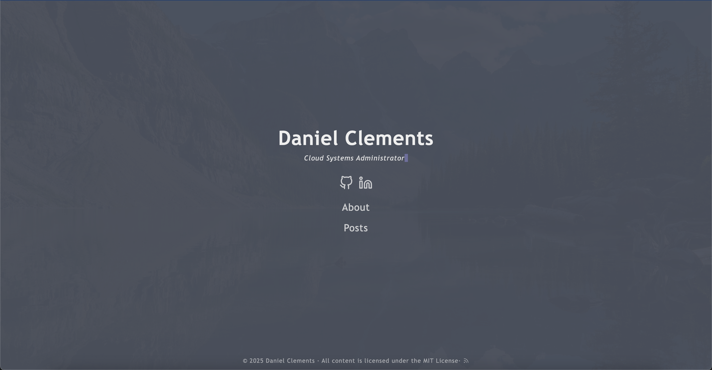

# danielclements.com

A personal website built with Hugo, featuring the Hermit-V2 theme, and deployed with Cloudflare Pages.

## Screenshot



## Overview

This repository contains the source code for my personal website [danielclements.com](https://danielclements.com). It's built as a static site using Hugo, a fast and flexible static site generator, with the minimalist Hermit-V2 theme.

## Tech Stack

- **Framework**: [Hugo](https://gohugo.io/) - A fast and modern static site generator
- **Theme**: [Hermit-V2](https://github.com/1bl4z3r/hermit-V2) - A minimal, responsive theme focused on content
- **Deployment**: [Cloudflare Pages](https://pages.cloudflare.com/) - Fast, secure, and scalable static site hosting
- **Domain & DNS**: [Cloudflare](https://cloudflare.com/) - DNS management and security

## Features

- Responsive design works on mobile, tablet, and desktop
- Dark mode support
- Fast loading times and optimized performance
- Content-focused layout with clean typography
- Simple and intuitive navigation

## Local Development

### Prerequisites

- [Hugo Extended](https://gohugo.io/installation/) (version 0.115.3 or newer)
- [Git](https://git-scm.com/downloads)

### Setup

1. **Clone the repository**
   ```bash
   git clone https://github.com/iamclements/danielclements.com.git
   cd danielclements.com
   ```

2. **Start the Hugo development server**
   ```bash
   hugo server -D
   ```

3. **View the site locally**
   Open your browser and navigate to [http://localhost:1313](http://localhost:1313)

### Adding Content

To create a new post:

```bash
hugo new posts/my-new-post.md
```

Edit the file in `content/posts/my-new-post.md` to add your content.

## Deployment

This site is automatically deployed to Cloudflare Pages when changes are pushed to the main branch.

### Manual Deployment

If you need to deploy manually:

1. Build the site
   ```bash
   hugo --minify
   ```

2. The built site will be in the `public/` directory, which can be deployed to any static site hosting service.

## Customization

### Configuring the Site

The site configuration is in `config.toml`. Edit this file to change site settings such as title, author information, social links, and theme options.

### Modifying the Theme

Theme customizations can be made in these locations:

- Custom CSS: `assets/css/custom.css`
- Custom layouts: Create files in the `layouts/` directory to override theme defaults
- Custom partials: Add files to `layouts/partials/` to customize specific sections


## Credits

- [Hugo](https://gohugo.io/) for the static site generation framework
- [Hermit-V2](https://github.com/1bl4z3r/hermit-V2) theme by [1bl4z3r](https://github.com/1bl4z3r)
- [Cloudflare Pages](https://pages.cloudflare.com/) for hosting and deployment

## License

This project is licensed under the MIT License - see the [LICENSE](LICENSE) file for details.

---